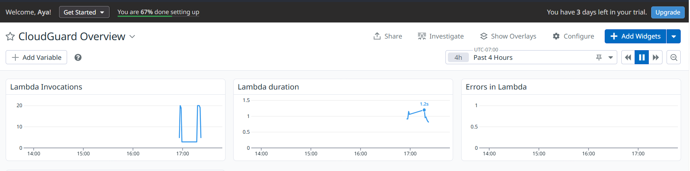

# CloudGuard

Log anomaly detection pipeline built on AWS.

CloudGuard watches application logs, uses Claude (via AWS Bedrock) to
classify entries as normal or anomalous, and sends an alert with the model's
reasoning when something looks off. Infrastructure is fully defined in
Terraform, deployed through a GitHub Actions CI/CD pipeline with a manual
approval gate, and monitored in Datadog.

## Why this project

Traditional log monitoring relies on hardcoded rules
(`if error_count > threshold: alert()`), which misses nuanced or novel
patterns. CloudGuard replaces that rule with an LLM call: the model reads
the log entry the way a human on-call engineer would, and explains *why*
something looks wrong, not just that a number crossed a line.
## How it works

1. A local Python script generates synthetic application logs (mostly normal
   traffic, with injected anomalies like failed login spikes and error
   floods) and writes them to CloudWatch Logs.
2. A CloudWatch subscription filter triggers a Lambda function on every new
   log entry.
3. The Lambda sends the log entry to Claude Haiku 4.5 via AWS Bedrock, asking
   it to classify the entry as normal or anomalous.
4. If Claude flags an anomaly, the Lambda publishes an alert to an SNS topic,
   which emails the result along with Claude's reasoning.
5. Lambda health (invocations, errors, duration) is monitored in a Datadog
   dashboard.

## Architecture

```
Log Generator (local script)
        |
        v
CloudWatch Logs -----> Subscription Filter -----> Lambda
                                                      |
                                                      v
                                              AWS Bedrock
                                              (Claude Haiku 4.5)
                                                      |
                                              anomaly? --yes--> SNS --> Email
```


## Stack

- **AWS**: Lambda, CloudWatch Logs, SNS, Bedrock, S3, IAM
- **Terraform**: infrastructure as code
- **GitHub Actions**: CI/CD pipeline (format check, validate, plan on every
  push/PR; manual-approval apply to AWS on merge to main)
- **Datadog**: Lambda health monitoring dashboard

## Project structure

cloudguard/
├── terraform/ # infrastructure (Lambda, CloudWatch, SNS, IAM, S3)
├── lambda/
│ └── anomaly_detector/ # Lambda source (Bedrock + SNS logic)
├── scripts/
│ └── log_generator.py # synthetic log generator
└── .github/workflows/ # CI/CD pipeline


## CI/CD

Every push or pull request runs `terraform fmt`, `validate`, and `plan`.
Applying to AWS requires a manual approval step (GitHub Environments with
required reviewers), so infrastructure changes are never deployed
automatically without review.

## Notes

- This is a personal portfolio project built to demonstrate an
  AI-integrated monitoring pipeline, IaC practices, and CI/CD design — not
  a production system.

## Status

✅ Core pipeline (log generation → detection → alerting) working end to end
✅ CI/CD pipeline with manual approval gate
✅ Datadog monitoring dashboard



Tracks Lambda invocations, duration, and errors, confirming the pipeline
runs reliably with no failures during testing.


